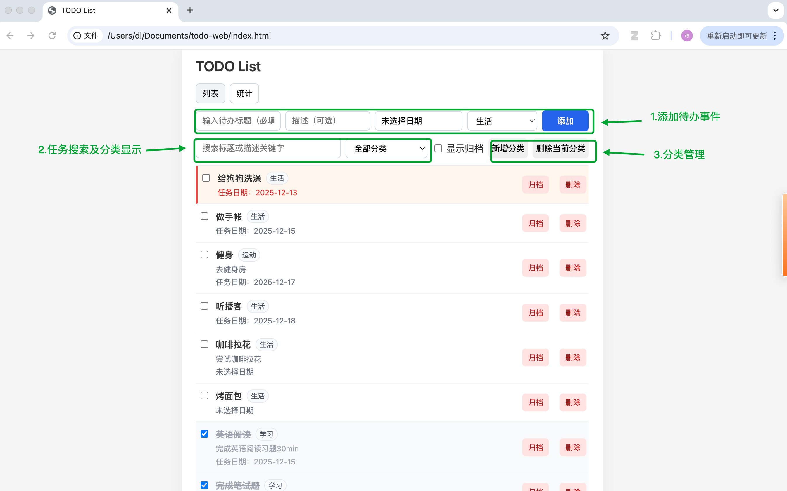
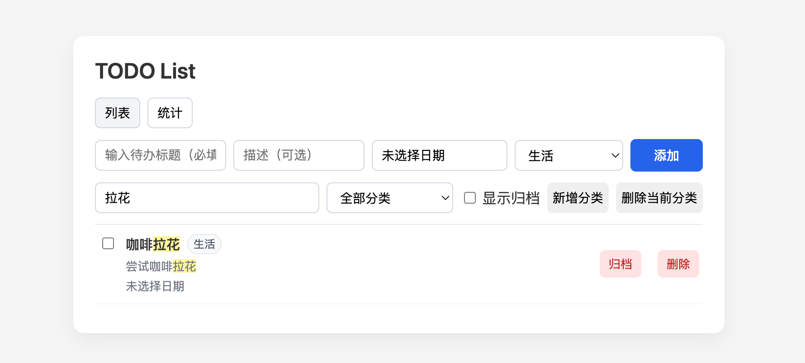
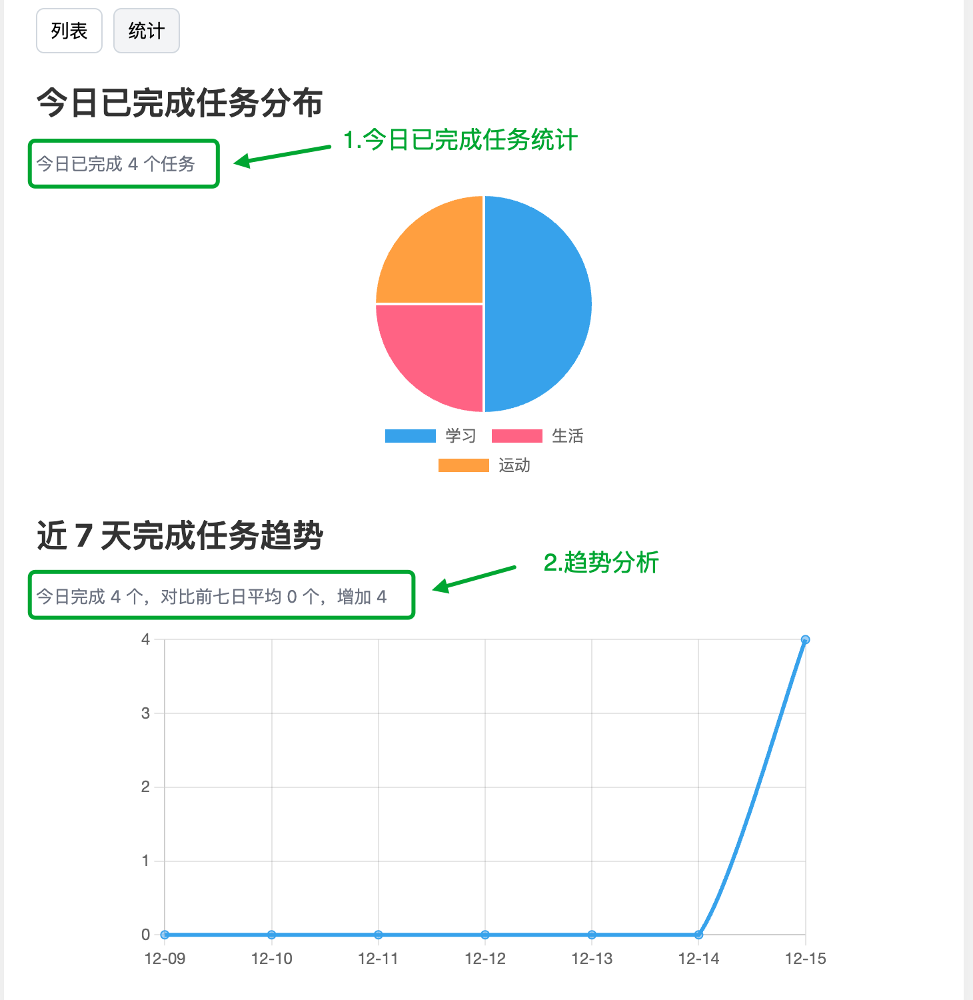

# TODO List 应用


## 功能概览

### 核心功能

- 添加待办事项  
  - 必填：标题  
  - 可选：描述、任务日期、分类
- 删除待办事项
- 标记待办事项完成 / 未完成
- 查看待办事项列表
  


### 扩展功能

- 数据持久化：使用 `localStorage` 保存任务和分类
- 任务分类：支持「工作 / 学习 / 生活」以及自定义分类  
  - 支持「全部分类」视图和「今日任务」视图
- 自动排序逻辑：
  1. 未完成任务在前，已完成任务在后
  2. 未完成任务中，有日期的排在前面，无日期的在后面
  3. 有日期的任务按日期从早到晚排序
  4. 日期一致时按创建时间先后排序
- 搜索与高亮：
  - 支持按标题 + 描述搜索
  - 搜索命中的关键字在列表中会高亮显示

- 统计视图：
  - 今日已完成任务分布（按分类的饼图）
  - 近 7 天完成任务趋势（折线图）
  - 通过页签在「列表视图 / 统计视图」之间切换



## 技术栈

- 原生 HTML / CSS / JavaScript（无前端框架）
- 浏览器 `localStorage` 用于数据持久化
- 使用 [Chart.js](https://www.chartjs.org/) 绘制统计图表（通过 CDN 引入）


## 文件结构

```text
.
├── index.html   # 页面入口
├── style.css    # 样式文件
└── main.js      # 主逻辑：状态管理、渲染、事件绑定与统计
````

---

## 本地运行方式

项目是纯静态网页，有两种常见运行方式：

### 方式一：直接打开文件

1. 克隆或下载本仓库代码
2. 在文件管理器中双击 `index.html`，用浏览器打开即可使用


## 浏览器兼容性

* 依赖 `localStorage` 和原生 ES5+ 特性
* 在现代浏览器（Chrome / Edge / Firefox / Safari 等）中均可正常运行


