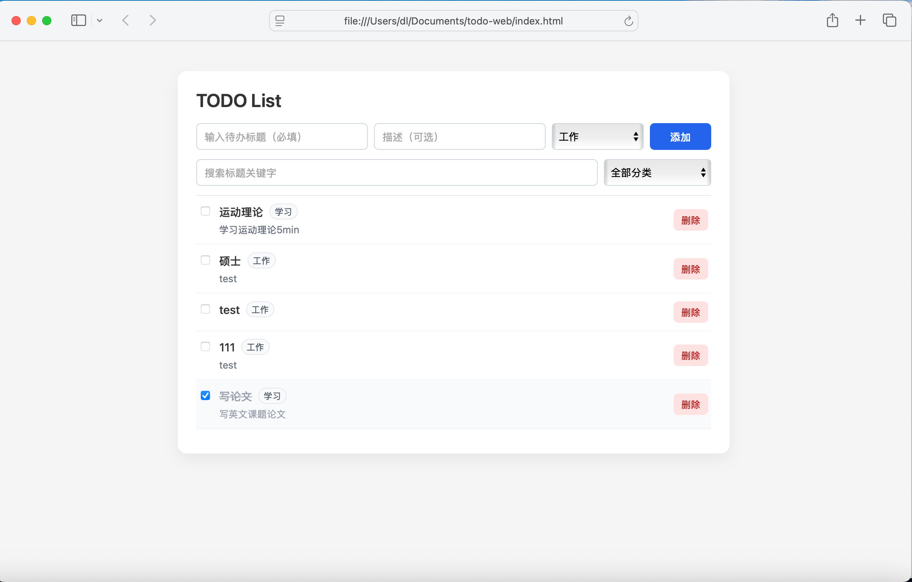

### 构建整体框架
为快速搭建项目，首先分析[技术岗位校招编程笔试题](https://github.com/iftechio/coding-challenge-2025/blob/main/README.md)文件，需要决定：
1. 工具、框架、语言；
2. 该TODO List设计原则，以及需要体现的优势。

首先让GPT帮我分析了从零开始搭建应用以什么技术和形式呈现可实施性最强，且兼顾用户交互体验，以此选择“HTML + JS + localStorage“ 方案，并基于GPT代码快速实现以下基本功能：
1. 添加待办事项（包含标题，描述可选）。
2. 删除待办事项。
3. 标记待办事项完成/未完成。
4. 分类查看待办事项列表。
5. 搜索待办事项。
界面如下：

试题有提到需要完成一些扩展功能，为了解决TODO List用户对于该类应用的实际需求，在论坛、应用市场中搜索该类型应用用户评价，发现用户需求主要包括：
- 好评提到“easy to use”“tab is easy to see”“simple”，最求**简约**（多人提到类似备忘录的简约感），但需要比备忘录强大的分类功能
- 有一些细节的需求，比如更便捷的删除逻辑“there should be a easier way to delete a group”：
    - 当删除一个分类组时，该组下的所有任务也需要被删除
- 有用户提出“add date to a task”存在问题使得她觉得软件不好用了，推断**给任务加日期**也是一个需求

分析界面功能存在的问题：
- 分类标签需要用户可删除和添加的标签
- 需要可拖动交换任务顺序
- 已完成任务移动到列表末尾

所有功能原则：
- 简洁
- 易操作

### 根据用户需求，完善功能
#### 分类管理
- 动态标签列表，每个分类组 = 一个标签 + 该标签下的任务集合
- 逻辑功能：
    - 新建分类（提供默认分类）
    - 删除分类
    - 自动清理空分类
- 界面设计：
    - 分类筛选下拉旁边一个“管理分类”入口，弹出简单管理区：
    - 展示所有分类，右边一个小“删除”按钮（删除分类时二次确认）
#### 任务日期管理
- 每个任务可以添加日期，增加“今日任务”分类单独展示当天任务
- 逻辑功能：
    - 给任务添加日期（不强制）
    - 排序逻辑中，未完成任务默认按到期日排序
- 界面设计：
    - 在视图顶部加一个简单筛选：“今日任务”

#### 列表排序与拖拽
- 任务列表支持拖动交换任务顺序，已完成任务移动到列表末尾

### 功能完善

#### 修复存在问题：
1. 已经创建任务的分类、任务日期无法修改问题
2. 创建任务时，未选择任务日期需要明确占位符“任务日期（可选）”
3. 日期一经选择无法取消

### UI问题修复及测试
#### 修复UI问题：
1. 任务创建行context框高度不一致
2. 任务列表中及任务创建行日期输入框右侧“清除”按钮位置
3. 匹配上的搜索词高亮

   
#### 测试问题及修复
1. 搜索目前只命中标题，不包括描述
2. 任务排序逻辑修复：任务不再可拖拽排序，按照任务日期自动排序

### 添加统计视图
- 为每个分类添加统计视图
- 逻辑功能：
  - 展示今日已完成任务分布（饼图）
  - 展示近 7 天完成任务趋势（折线图）

### 修复统计视图，补充文档内容
#### 修复统计视图问题
- 修复饼图为空时的显示问题
- 修复折线图label显示问题

#### 完善功能
- 引入简单的提醒机制
   - 高亮显示已经过期但未完成的任务
- 加入简单的「归档」功能，避免历史任务过多影响列表可读性
  
#### 补充README.md&DOC.md文档内容
- 补充README.md&DOC.md文档内容

